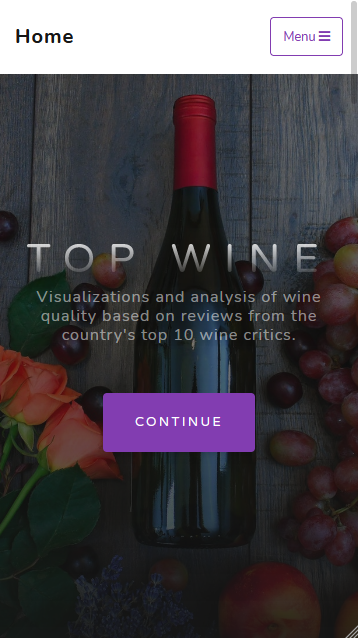
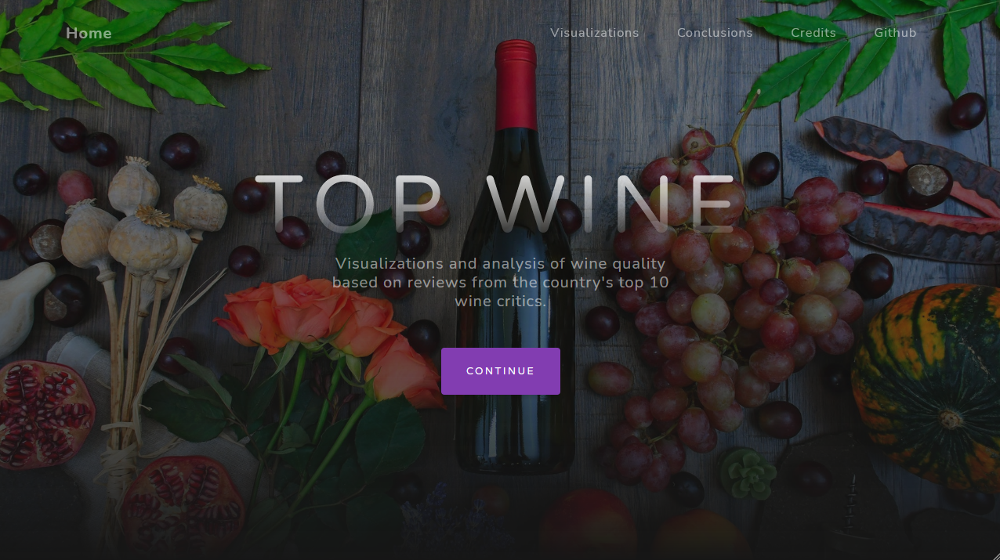
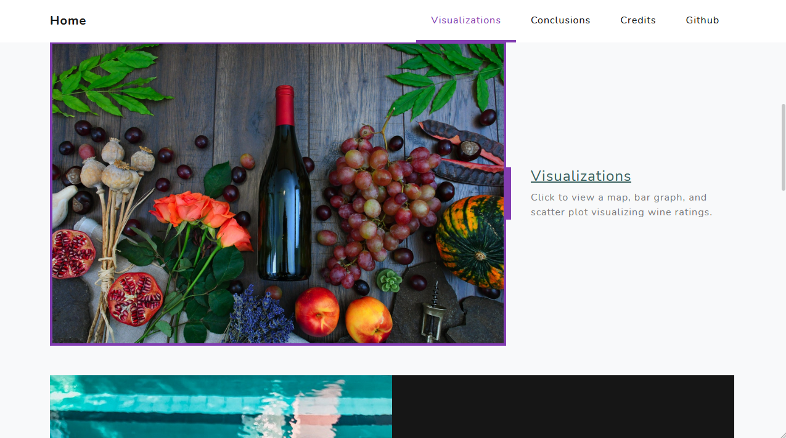
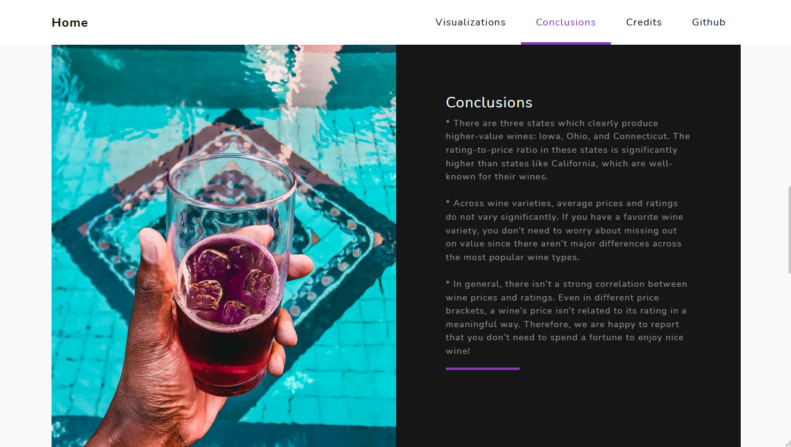
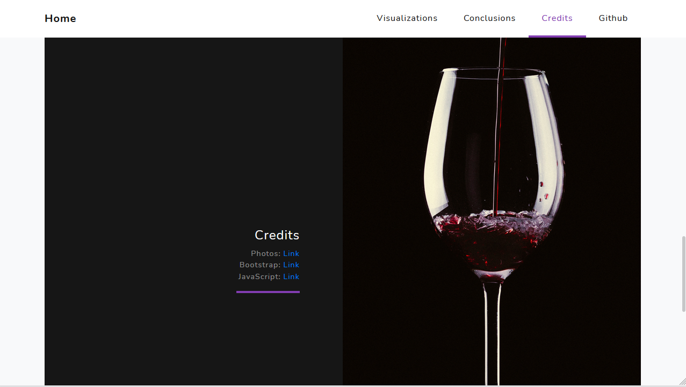
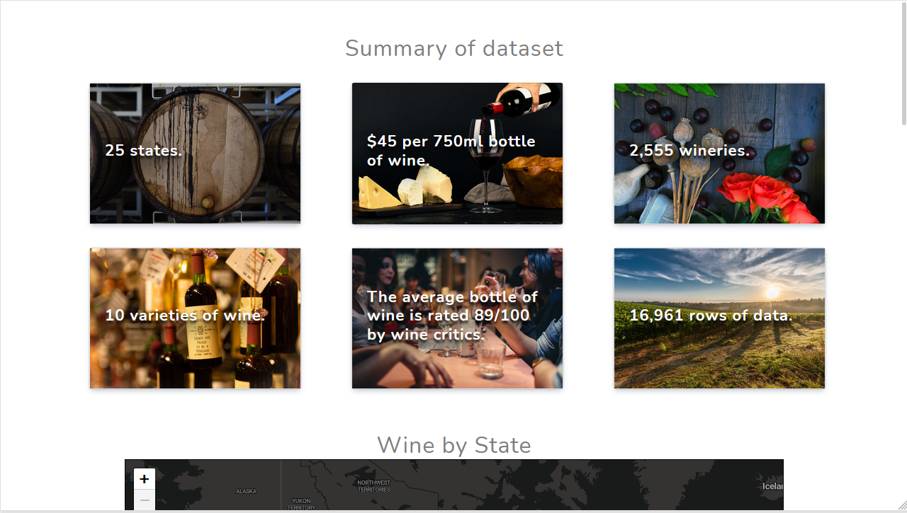
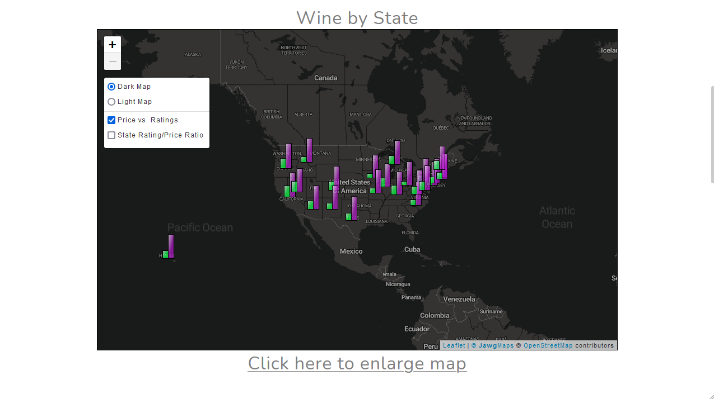
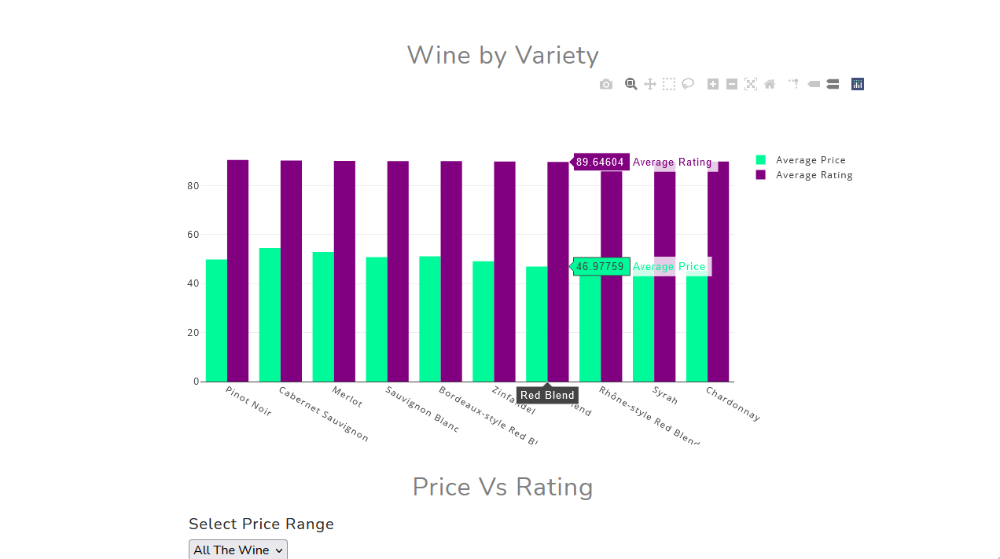
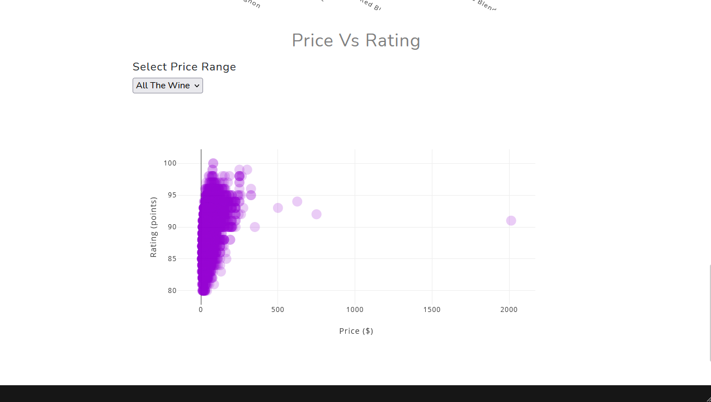
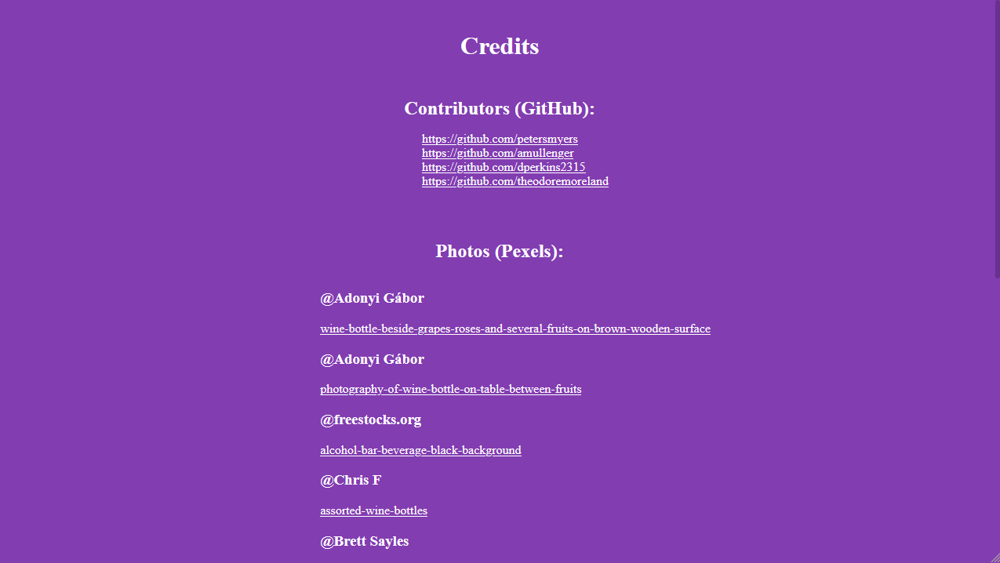

# Top Wine

Our goal for this project is to create a set of visualizations to show how wine varieties, pricing, and ratings vary by location in the United States. We also want to show how ratings and price differ between wine varieties. The data set we are using comes from a web scraping project that sourced data points on individual wines from WineEnthusiast back in 2017. The data points collected include country of origin, description, points (rating), region, price, variety, etc.

## Table of content

- [Group members](#group-members)
- [Key questions](#key-questions)
- [Visualizations](#visualizations)
- [Dataset](#dataset)
- [Technologies Used](#technologies-used)
- [Screenshots](#screenshots)

### Group Members:

Peter Meyers, Andrew Mullenger, Theodore Moreland, Danielle Perkins

### Key Questions:

1. Which types of wine have the highest ratings?
2. Which types of wine command the highest prices?
3. Which states produce wines that command the highest prices?
4. Which states produce wines that have the highest ratings?

### Visualizations:

- Map Layers:

  - Bar graph markers showing average price and rating for wine grown in each state
  - Production heatmap showing where the most wine is produced.
    - Filter by wine variety to show where different types of wine are commonly produced.

- Basic graphs (not on map):

  - Scatter plot showing the relationship between number of vineyards and avg wine price per state.
  - Combined bar chart showing average bottle price for each wine variety and average rating per variety.

For our new JavaScript library, we will be using a leaflet plugin called "Leaflet Data Visualization Framework" to create bar chart markers for average price and average rating per state. Here is the GitHub link for this plugin: https://github.com/humangeo/leaflet-dvf.

### Dataset

Link to Dataset: https://www.kaggle.com/zynicide/wine-reviews/version/4?

# Technologies used:

Python version `3.8` (`3.8.10` specifically) works for the current packages used in `requirements.txt`. Conversely, Python `3.11` does not work and will require an updated to the aforementioned packages to resolve version conflicts.

- Data Wrangling (Python, Pandas, R)
- Storage (SQLite)
- Backend (Python, Flask)
- Frontend (JavaScript, Bootstrap 4, HTML5/CSS3)
- Web Host (AWS)

# Screenshots:

# Landing page - View #1 (Mobile)

# Landing page - View #1 (Desktop)

# Landing page - View #2 (Desktop)

# Landing page - View #3 (Desktop)

# Landing page - View #4 (Desktop)

# Visualizations page - View #1 (Desktop)

# Visualizations page - View #2 (Desktop)

# Visualizations page - View #3 (Desktop)

# Visualizations page - View #4 (Desktop)

# Credits page (Desktop)

